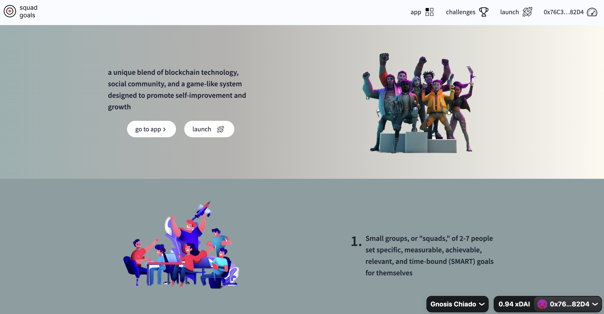
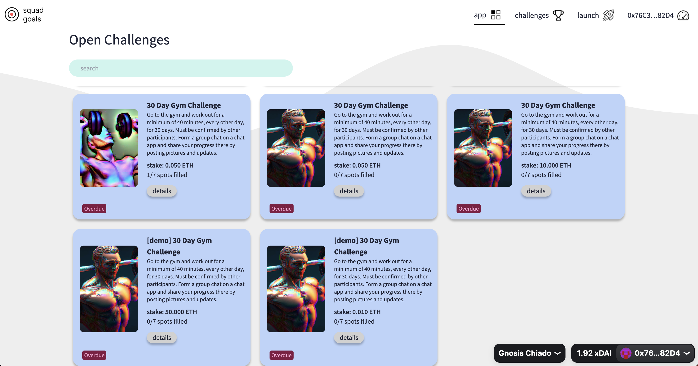
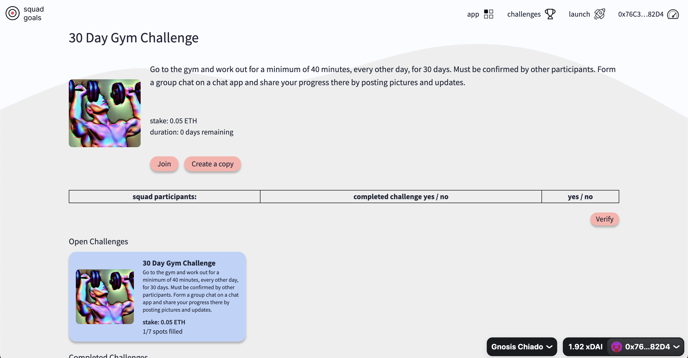
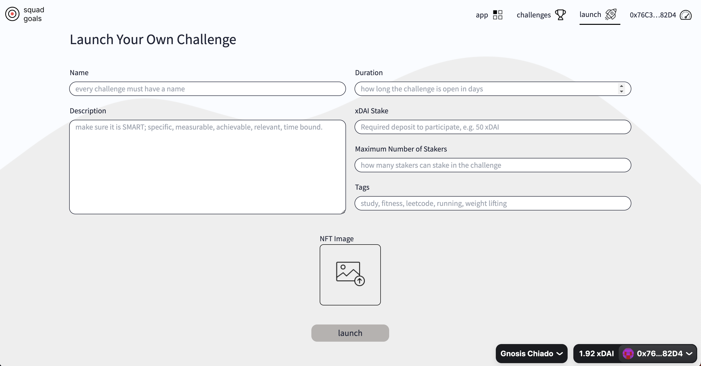
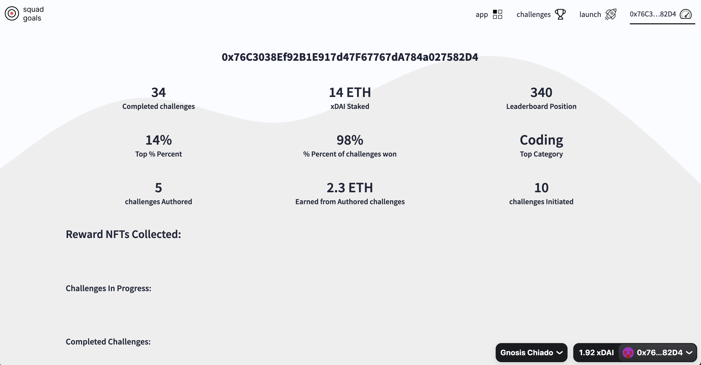

# Squad Goals

## Summary

A crypto protocol that helps you achieve your goals with your squad. Set a goal, find a group of individuals to join your squad, stake some crypto. If you complete your goal, you win a Reward NFT, get your stake back plus the crypto that those that didn't succeed. If you don't complete it, you forfeited your stake and it is divided up by the winners.

### How it works

1. Create a new challenge or copy from library of community created challenges

2. A challenge is a 'SMART' goal (Specific, Measurable, Attainable, Relevant, Time-Bound)

3. Find a Squad or join one

4. Stake MATIC to start the challenge

5. When the challenge deadline is met, vote for all the participants if they have succeeded or not

6. Those that have majority votes, get their stake back + Reward NFT + portion of the forfeited stake of the losers

7. If you loose, your stake is forfeited: 10% for to challenge creator, 10% to the protocol, and the rest for the winners in the squad.

8. Earn MATIC by creating popular challenges in the community

---

### How to create a Challenge

1. Go to the 'Launch' page

2. Fill in the form:

   - Name

   - Description

   - Duration (in days)

   - MATIC stake

   - Maximum Number of Stakers

   - Tags

   - NFT Image

3. Click 'Launch'

4. Congratulations, now you are a creator of a challenge, you will receive 10% of all future participants of this challenge as a reward.

---

## Pitchdeck

https://pitch.com/public/a79070a3-6140-43bb-8531-8047d0379bb7

## Video Demo

## Live Site

https://squad-goals-polygon.vercel.app/

---

## Screen Shots

#### home page

#### challenge list

#### challenge detail

#### create challenge

#### user dashboard

